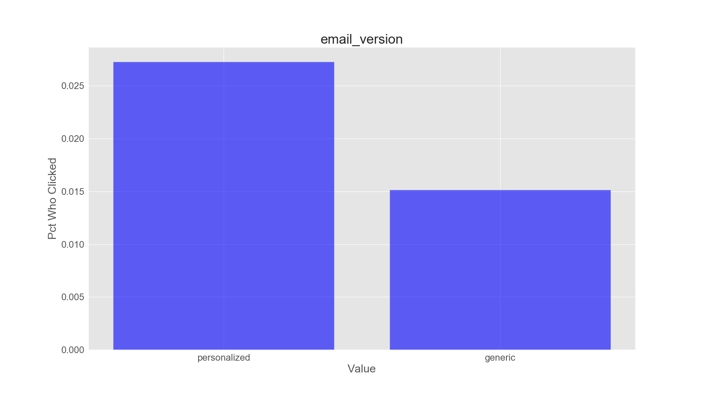

# Email Marketing Project

## Notes
Email marketing: free and customizable

Questions:
* Email open rate
* CTR
* Model to maximize CTR
 * build model to predict if click
 * identify key features
* What would be the improvement in CTR vs random?
* How would this be tested?
* Inference: how did email campaign perform across users?

Conclusions and BR

## Results of Email Campaign
Percentage of people who opened the email: 10.345%  
Percentage of people who clicked on the email: 2.119%

## Modeling
A baseline model is simply randomly selecting users to email, or emailing all users. This will provide a CTR of ~ 2.119%

A Random Forest Classifier produced a True Positive Rate of 0.96 in the positive class. Translation: 96% of those who actually clicked were identified by the model.

## Classification Report

## Confusion Matrix

## ROC Curve

## Analysis and Recommendations

Sending the maketing email to only those customers predicted to click by the model should result in CTR of ~96%. However, since this number is less than 100%, there will inevitably some customers (around ~4%) who would have clicked, but did not recieve the email. The way test this would be to set up an A/B test. In the control group, eveyone would receive the marketing email. In the experiment group, only those predicted to click by the model would receive the marketing email.

We must identify which is more important: the click-through rate, or the raw of number of click-throughs. Assuming that the cost of sending a marketing email is close to zero, it may be best to simply send the email to all users. If on the other hand there is significant cost to sending an email to customer who will not click, the a profit analysis needs to be performed to identify the optimum model prediction threshold. 

## Email Campaign Performance Across Users

### Percentage of Recipients Who Clicked By Feature

### Recommendations

Caveat: these are initial obervations based on the data. Proper testing would be required to determine if these distinctions fall outside of the range of expected variance.

US and UK users clicked at much higher rate. Consider if French and Spanish translations need to be improved.

Shorter and more personalized emails led to higher click percentages.

Users with greater past purchases tended to click more.

Friday and Sunday appear to be worst days to send the email.